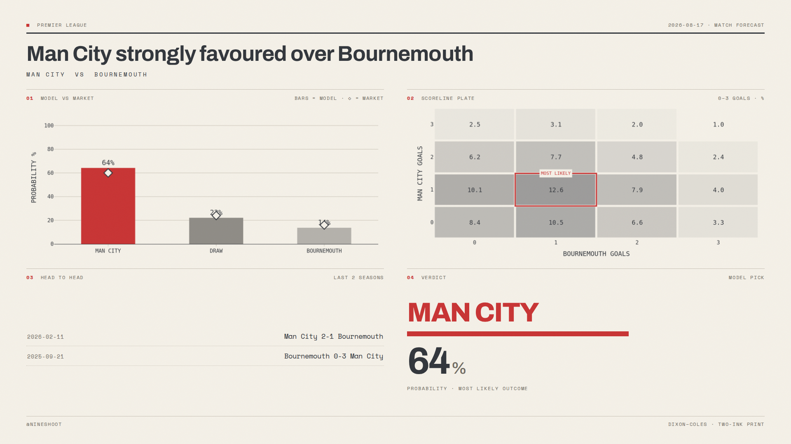
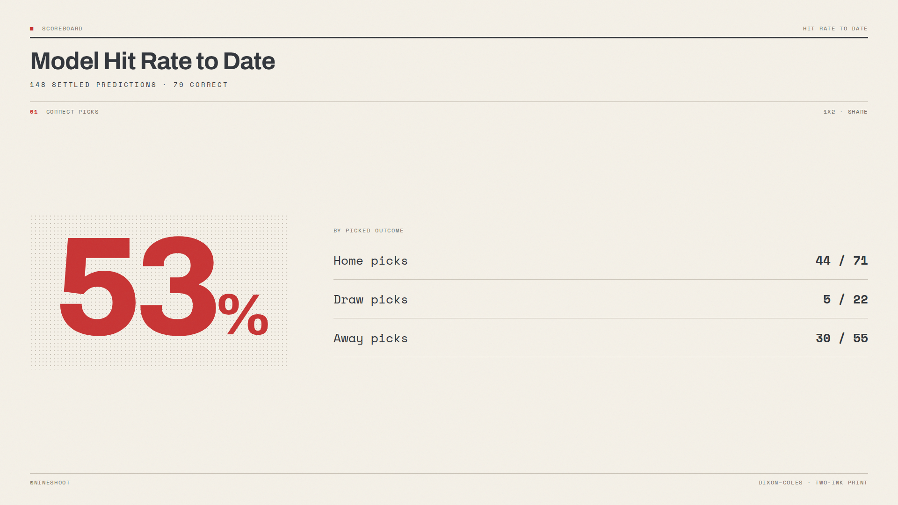

# ⚽ ArSim's Soccer Analysis

A **zero-server, zero-cost** system that predicts upcoming football matches
from **pre-match data only** (no live/in-play), logs every prediction before
kickoff, and grades itself against the market. Runs unattended on GitHub
Actions and commits fresh sheets back to the repo.

Built on [`penaltyblog`](https://github.com/martineastwood/penaltyblog)
(Dixon-Coles goal model with time decay) + free data from
[football-data.co.uk](https://www.football-data.co.uk/).

---

## Preview

Every fixture gets one printed sheet — model vs market, scoreline plate,
head-to-head, and the verdict as the focal event. Two inks only (charcoal +
signal red), pale-beige paper, hairline rules — the
[`mono-color`](https://github.com/yanliudesign/mono-color-skill) editorial
print system applied to a data sheet.



The same two-ink system carries over to the aggregate sheets — hit rate,
calibration:



*(Rendered from `python -m src.viz` — synthetic demo data, not a live prediction.)*

## Why it's built this way

|Decision|Reason|
|-|-|
|**Dixon-Coles + time decay**, not just Poisson|Corrects Poisson's known under-count of low-scoring draws; recent form weighted heavier.|
|**Benchmark vs closing odds**|The honest test isn't "% correct" — it's whether the model tracks the market. Closing odds are the sharpest public probability.|
|**`predictions_log.csv` written *before* kickoff**|The one file that makes the whole thing trustworthy: no hindsight, real calibration.|
|**GitHub Actions cron = the "automation"**|No Dataiku, no server, no bill. The green run-history *is* the automation.|
|**Static PNGs (Plotly + Playwright)**|Drop straight into a video-editing pipeline — no dashboard to host, no server to run.|
|**Retry-with-backoff on every fetch**|football-data.co.uk occasionally 503s under load. A transient blip shouldn't cost a whole week's predictions.|
|**Concurrency-locked, rebase-before-push CI**|Two overlapping runs (schedule + manual dispatch) used to race on the final `git push` and fail the job outright.|

## How it works

```
                 football-data.co.uk (results + odds, free)
                              │
        ┌─────────────────────┴─────────────────────┐
        │  scrape historical results  │  scrape upcoming fixtures │
        │       (retried on 503)      │                           │
        └─────────────────────┬─────────────────────┘
                              │
     Dixon-Coles fit (time-decay)     strip bookmaker overround
                              │                    │
                       predict 1X2 / O-U / BTTS    │
                              │                    │
                     ┌────────┴─────────┐          │
              predictions_log.csv   mono-color sheet ◄─┘  (model vs market,
                     │                (Plotly + Playwright)  heatmap, H2H, verdict)
             (later) settle results ──► calibration + scoreboard sheets
```

## Layout

```
arsims-soccer-analysis/
├── config.yaml               # leagues, seasons, xi, odds priority
├── requirements.txt
├── docs/                     # README preview images
├── src/
│   ├── data.py               # download results + fixtures (retried on 503)
│   ├── model.py              # Dixon-Coles wrapper (penaltyblog)
│   ├── odds.py               # bookmaker odds → fair probabilities
│   ├── logger.py             # the calibration ledger
│   ├── stats.py              # win-rate scoreboard stats
│   ├── viz.py                # mono-color print sheets: match, calibration, scoreboard
│   └── predict.py            # per-league orchestration + head-to-head lookup
├── scripts/
│   ├── check_fixtures.py     # dev tool: peek at fixtures.csv freshness
│   ├── run_pipeline.py       # main entry: predict + log + sheets
│   └── settle_results.py     # back-fill actual results
├── output/                   # generated PNGs (auto-committed by CI)
├── predictions_log.csv       # created on first run
└── .github/workflows/predict.yml   # Thu predict · Mon settle
```

## Run it locally

```bash
pip install -r requirements.txt
playwright install chromium        # one-time: headless browser for sheet rendering
python -m scripts.run_pipeline     # predict this week's fixtures
# ...after the matches are played:
python -m scripts.settle_results   # fill in results
python -m scripts.run_pipeline     # redraw calibration curve
```

Sheets land in `output/`, one `{league}_{home}_{away}_dashboard.png` per
fixture, grouped into a `output/<monday-of-that-week>/` folder. Predictions
accumulate in `predictions_log.csv`.

Want to preview the sheet design itself without running the full pipeline
(no network needed — uses synthetic demo data)?

```bash
python -m src.viz /tmp/preview   # writes sheet_match.png + sheet_scoreboard.png
```

## Automate it (GitHub Actions)

Push to GitHub — `.github/workflows/predict.yml` already schedules:

* **Thursday 07:00 UTC** — predict the weekend's fixtures + render sheets
* **Monday 09:00 UTC** — settle results + redraw calibration

It commits `predictions_log.csv` and `output/*.png` back automatically.
Trigger a manual run anytime from the **Actions** tab (`workflow_dispatch`).

The workflow is concurrency-locked (`concurrency: group:` on the workflow
name) so a manual run and a scheduled run can never race each other, and the
final commit step rebases onto `origin/main` before pushing — so a merge
landing on `main` while the job is running doesn't fail the whole run.

## Tuning

* **`config.yaml → model.xi`** — decay speed. Higher = forget old games
faster. Backtest to find the sweet spot for each league.
* **`odds_priority`** — which bookmaker columns to benchmark against.
* **`leagues`** — add `I1` (Serie A), `D1` (Bundesliga), `F1` (Ligue 1).

## Where to take it next

* Swap in **xG-based** attack/defence strengths via
[`soccerdata`](https://github.com/probberechts/soccerdata) (FBref/Understat).
* Add an **ensemble** second model (XGBoost on Elo gap + market value),
weighted like the reference design in `caroescm/football-odds`.
* Track **Ranked Probability Score / log-loss vs closing odds** in the log —
the real scoreboard.

## Data credit

Results & odds: football-data.co.uk. If you later use StatsBomb Open Data
(`hudl/open-data`) for xG features, credit StatsBomb per their terms.
